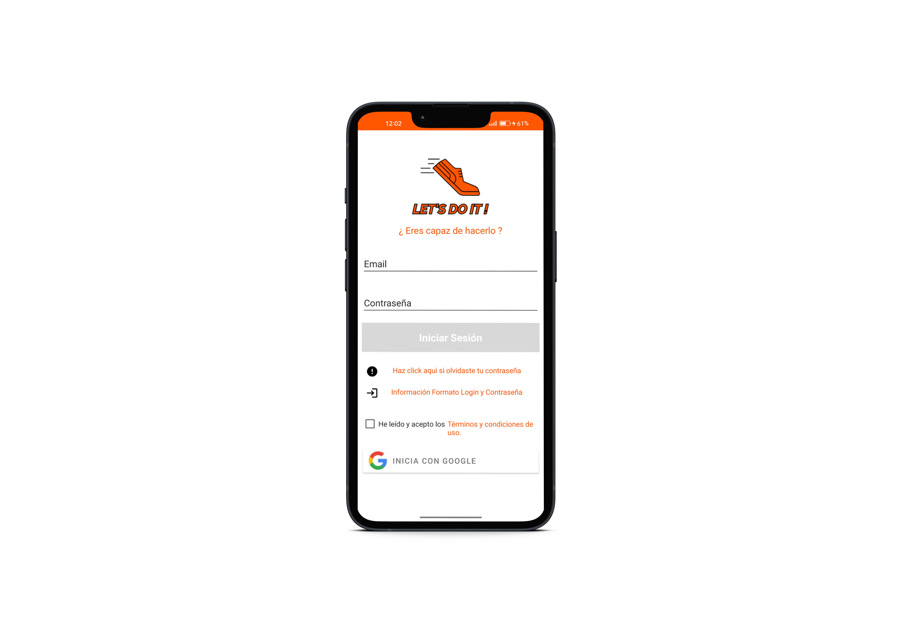
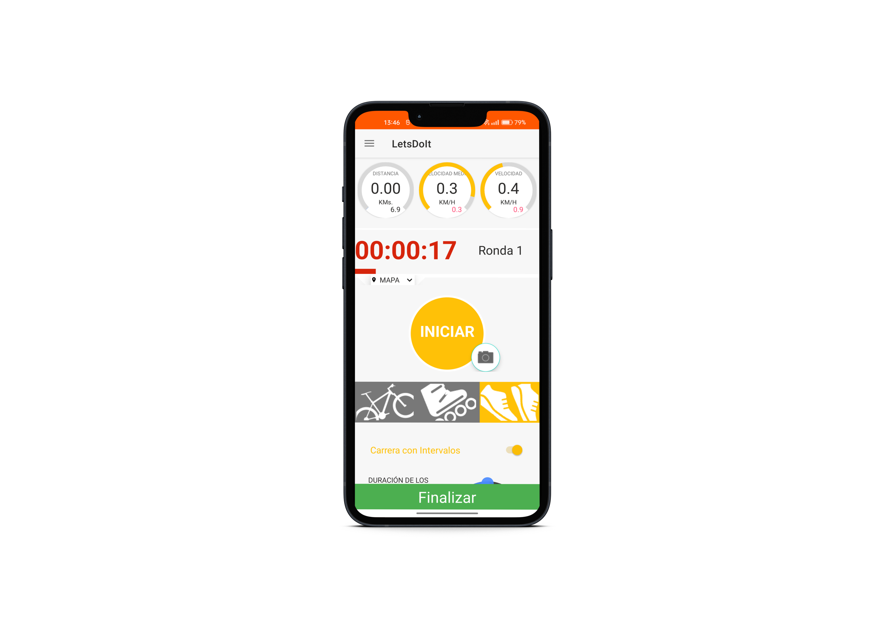
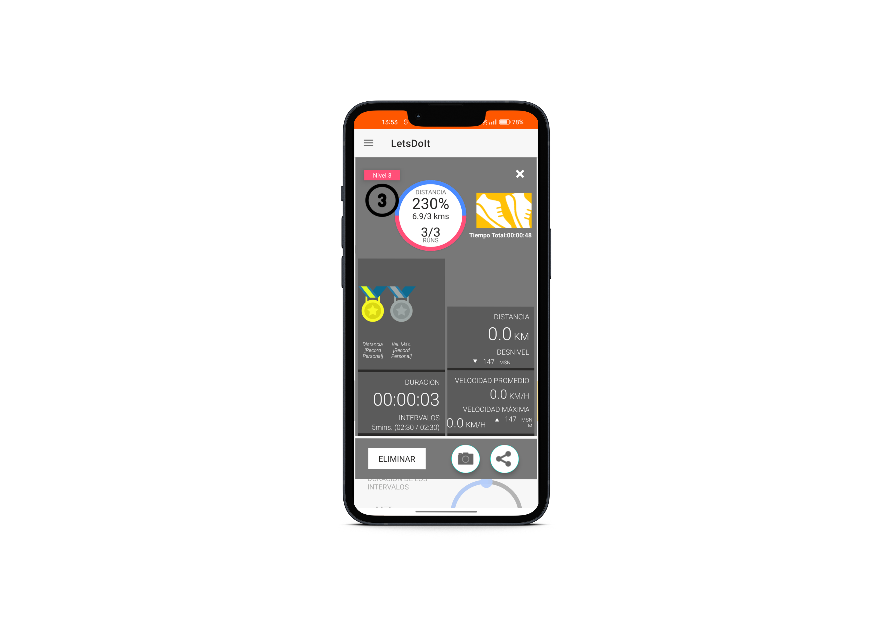

# Let's Do it app
## Imágenes:
------------
Aquí te mostramos algunas imágenes de la app en acción:

  
  

  
  

## Descripción
--------------
Let's Do iT es una app que permite a los usuarios hacer seguimiento y gestión de su actividad deportiva, facilitando el registro de sus entrenamientos, el establecimiento de objetivos y el monitoreo del progreso en tiempo real.

## Estructura de directorios del proyecto:
-----------------------------------------
1. apk: Contiene el fichero .apk de la aplicación para dispositivos Android con
   minSdk 23 y targetSdk 33.
2. code: Contiene el proyecto de Android Studio.
3. images: Capturas de la app.
4. pdf: Presentación en PDF.

## Opción Premium:
--------------
Para probar la opción Premium de la aplicación, utilice la cuenta sandbox de
PayPal con los siguientes datos:

Email:sb-gjkgs25146907@personal.example.com
Password:{-lUnK=1

## Instalación:
-----------
1. Descargue el fichero .apk del directorio apk.
2. Instale el fichero .apk en un dispositivo Android con minSdk 23 y targetSdk 33.
3. Abra la aplicación y regístrese para comenzar a utilizarla.

## Uso:
---
1. Registre sus actividades deportivas y entrenamientos en la aplicación.
2. Establezca objetivos personales y siga su progreso a lo largo del tiempo.
3. Utilice la opción Premium para acceder a funciones adicionales, como análisis
   detallados de su rendimiento y opciones personalizadas.

## Soporte:
-------
Si necesita asistencia o tiene preguntas sobre la aplicación, por favor
contacte al autor:

Jose Enrique Jordan Moreno
Correo electrónico: josejordan@outlook.com

## Licencia:
--------
Esta aplicación y todo su contenido están protegidos bajo la licencia MIT.
Para más información, consulte el archivo LICENSE.

